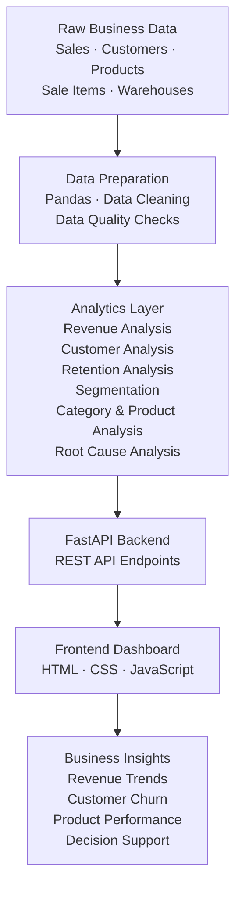

# Business Memory — System Architecture

## 1. Overview

Business Memory is a business analytics and decision-support platform designed to analyze retail business performance, identify revenue changes, understand customer behavior, and generate actionable business insights.

The system follows a layered architecture:

**Data Sources → Data Processing → Analytics → FastAPI Backend → Interactive Dashboard**

---

## 2. Architecture Diagram

---

## 3. Architecture Components

### 3.1 Data Layer

The data layer contains generated business datasets in CSV format.

Key datasets include:

- Sales
- Sale Items
- Customers
- Products
- Warehouses
- Suppliers

These datasets form the foundation for business analysis.

### 3.2 Data Processing Layer

Python and Pandas are used to load, clean, transform, and prepare the data.

The centralized `analytics/data_loader.py` module provides reusable data-loading functions to reduce repeated logic across analytics scripts.

### 3.3 Analytics Layer

The analytics layer transforms prepared data into business metrics and insights.

| Module | Purpose |
|---|---|
| Metrics | Overall business KPIs |
| Business Events | Detect business changes |
| Customer Analysis | Customer activity and revenue impact |
| Retention Analysis | Retained, churned, and new customers |
| Customer Segmentation | Group customers by behavior |
| Category Analysis | Compare category revenue |
| Product Analysis | Identify growing and declining products |
| Root Cause Analysis | Investigate revenue movement |

### 3.4 Backend Layer

The backend is developed using FastAPI.

It exposes REST API endpoints that provide analytics results to the frontend.

Key endpoints include:

- `/api/health`
- `/api/overview`
- `/api/revenue`
- `/api/customers`
- `/api/retention`
- `/api/segments`
- `/api/categories`
- `/api/products`
- `/api/root-cause`

### 3.5 Presentation Layer

The frontend is built using:

- HTML for structure
- CSS for styling
- JavaScript for interactivity and API integration

The dashboard presents KPIs, revenue comparisons, customer retention, category performance, product movement, and business insights.

---

## 4. End-to-End Data Flow

1. Business datasets are stored in CSV files.
2. Python and Pandas load and prepare the datasets.
3. Analytics modules calculate business metrics and identify patterns.
4. FastAPI exposes the analytical results through REST endpoints.
5. JavaScript fetches data from the backend.
6. The dashboard displays the results in a visual format.
7. Business users can interpret performance changes and investigate possible causes.

---

## 5. Technology Stack

| Layer | Technologies |
|---|---|
| Programming | Python |
| Data Analysis | Pandas |
| Backend | FastAPI |
| API Server | Uvicorn |
| Frontend | HTML, CSS, JavaScript |
| Data Storage | CSV files |
| Version Control | Git, GitHub |

---

## 6. Business Objective

The platform aims to help users:

- Monitor overall business performance.
- Compare monthly revenue and order trends.
- Identify customer churn and retention patterns.
- Analyze customer segments.
- Detect growing and declining products.
- Investigate factors contributing to revenue changes.

The architecture separates data preparation, analytics, API delivery, and presentation to support maintainability and future extension.